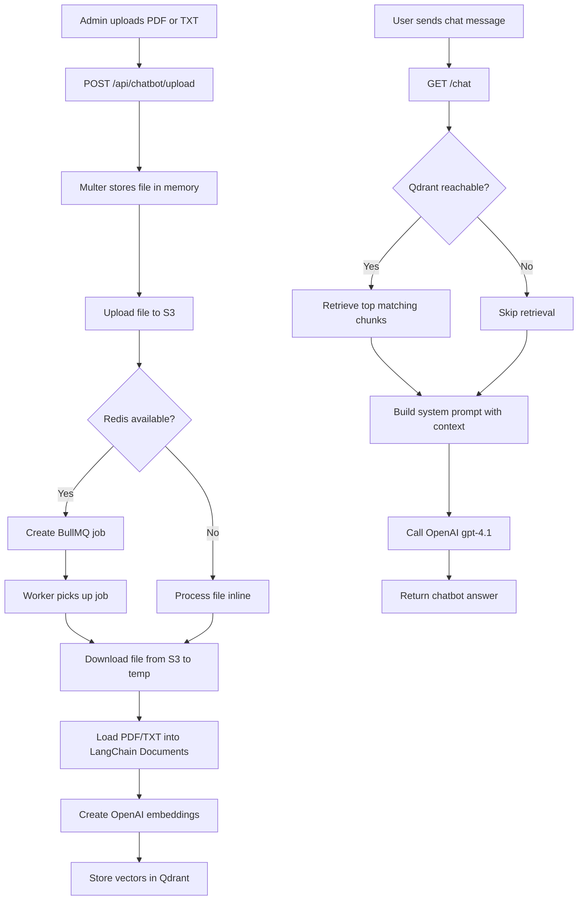

# EventSpot Chatbot Architecture

This document explains how the EventSpot chatbot was built in the backend, what services and libraries it uses, and how a user question moves through the system.

## Goal

The chatbot helps users with:

- event discovery
- bookings and tickets
- organizer workflows
- dashboard usage
- answers grounded in uploaded PDF or TXT knowledge files when available

The chatbot name in the current implementation is `Chitti`.

## Main Building Blocks

### 1. API layer

The chatbot endpoints live in [index.js](/Users/selvamurugan/Documents/Event-Spot/event-spot-backend/index.js):

- `POST /api/chatbot/upload`
- `GET /api/chatbot/files`
- `GET /api/chatbot/files/:filename/preview`
- `DELETE /api/chatbot/files/:filename`
- `GET /chat`

### 2. OpenAI

Used for two different jobs:

- embeddings with `text-embedding-3-small`
- final chat response generation with `gpt-4.1`

Relevant code:

- [index.js](/Users/selvamurugan/Documents/Event-Spot/event-spot-backend/index.js:281)
- [utils/chatbotIngestion.js](/Users/selvamurugan/Documents/Event-Spot/event-spot-backend/utils/chatbotIngestion.js:88)

### 3. LangChain

LangChain is used as the glue layer for:

- document loading
- document objects
- embeddings integration
- Qdrant vector store integration
- retriever creation

Packages used:

- `@langchain/openai`
- `@langchain/community`
- `@langchain/core`
- `@langchain/qdrant`

### 4. Qdrant

Qdrant is the vector database used to store embedded document content and retrieve relevant chunks during chat.

Relevant code:

- [utils/qdrant.js](/Users/selvamurugan/Documents/Event-Spot/event-spot-backend/utils/qdrant.js)

### 5. S3

Uploaded chatbot files are stored in AWS S3 before ingestion. This gives us durable storage and lets the worker or inline processor fetch the same file later.

Relevant code:

- [utils/chatbotStorage.js](/Users/selvamurugan/Documents/Event-Spot/event-spot-backend/utils/chatbotStorage.js)
- [utils/s3Client.js](/Users/selvamurugan/Documents/Event-Spot/event-spot-backend/utils/s3Client.js)

### 6. Redis + BullMQ

Redis and BullMQ are used to queue uploaded files for asynchronous processing. If Redis is unavailable, the backend falls back to processing the file inline.

Relevant code:

- [utils/redisQueue.js](/Users/selvamurugan/Documents/Event-Spot/event-spot-backend/utils/redisQueue.js)
- [worker.js](/Users/selvamurugan/Documents/Event-Spot/event-spot-backend/worker.js)

## Supported File Types

The backend currently accepts:

- `PDF`
- `TXT`

Upload validation happens in [index.js](/Users/selvamurugan/Documents/Event-Spot/event-spot-backend/index.js:138).

## How We Built It

### Step 1. Admin uploads a knowledge file

An admin sends a file to `POST /api/chatbot/upload`.

Flow:

1. `multer` reads the file into memory.
2. The backend validates that only one file was uploaded.
3. The file is stored in S3 using `uploadChatbotFileToS3`.
4. The backend checks whether Redis is reachable.
5. If Redis is available, it creates a BullMQ job.
6. If Redis is not available, it processes the file immediately inside the API request.

Relevant code:

- [index.js](/Users/selvamurugan/Documents/Event-Spot/event-spot-backend/index.js:204)

### Step 2. The file is prepared for ingestion

The ingestion logic lives in [utils/chatbotIngestion.js](/Users/selvamurugan/Documents/Event-Spot/event-spot-backend/utils/chatbotIngestion.js).

What happens:

1. The backend resolves the file source.
2. If the file already exists locally, it uses that path.
3. If the file came from S3, it downloads it to a temporary file.
4. It checks whether Qdrant is reachable before doing any embedding work.

### Step 3. The document is loaded

The backend loads content differently based on file type:

- PDF files are loaded with `PDFLoader`
- TXT files are read with `fs.readFile`

Each loaded document is converted into a LangChain `Document` and labeled with metadata such as the source file name.

### Step 4. Embeddings are created

The backend creates embeddings using:

- model: `text-embedding-3-small`

Each document chunk is transformed into a vector representation so it can be searched semantically later.

### Step 5. Vectors are stored in Qdrant

The vector store is created with Qdrant. The backend:

1. creates or ensures the collection exists
2. adds the document chunks to the collection

This is what makes retrieval-augmented generation possible.

### Step 6. The worker can process uploads asynchronously

If Redis is running, `POST /api/chatbot/upload` queues the file instead of processing it inline.

The worker in [worker.js](/Users/selvamurugan/Documents/Event-Spot/event-spot-backend/worker.js):

1. listens to `file-upload-queue`
2. receives file metadata from BullMQ
3. calls `processChatbotFile`
4. logs success or failure

This keeps upload requests fast and moves heavier embedding work out of the request cycle.

## How Chat Answers Work

The chat endpoint is `GET /chat?message=...`.

Relevant code:

- [index.js](/Users/selvamurugan/Documents/Event-Spot/event-spot-backend/index.js:262)

Flow:

1. The backend validates that a question was provided.
2. It checks `OPENAI_API_KEY`.
3. It checks whether Qdrant is reachable.
4. If Qdrant is available, it creates an embeddings instance and a retriever.
5. The retriever fetches the top matching document chunks with `k: 2`.
6. The backend builds a system prompt for `Chitti`.
7. If relevant docs were found, their content is injected into the prompt as context.
8. The backend sends the final request to OpenAI `gpt-4.1`.
9. The response is returned to the frontend with:
   - `message`
   - `docs`
   - `knowledgeBaseStatus`

### Important behavior

If Qdrant is down or the knowledge base is empty, the chatbot still responds. In that case it falls back to general EventSpot guidance instead of document-grounded answers.

That fallback is implemented in [index.js](/Users/selvamurugan/Documents/Event-Spot/event-spot-backend/index.js:300).

## End-to-End Flow Diagram

## Components and Responsibilities

### `index.js`

- defines chatbot upload and chat endpoints
- stores files in S3
- decides queue mode vs inline mode
- retrieves relevant docs during chat
- calls the chat model

### `utils/chatbotStorage.js`

- uploads files to S3
- lists uploaded files
- previews uploaded files
- deletes uploaded files
- downloads S3 files to a temporary local path for ingestion

### `utils/chatbotIngestion.js`

- resolves where the file comes from
- loads PDF or TXT content
- creates embeddings
- stores vectors in Qdrant

### `utils/qdrant.js`

- creates the Qdrant client
- creates the vector store
- builds the retriever
- checks whether Qdrant is reachable

### `utils/redisQueue.js`

- checks whether Redis is reachable
- returns a BullMQ queue instance when available
- safely falls back to inline processing when Redis is down

### `worker.js`

- processes queued file-ingestion jobs

## Environment Requirements

At minimum, the chatbot depends on:

- `OPENAI_API_KEY`
- `QDRANT_URL`
- `AWS_BUCKET_NAME`
- `AWS_REGION`
- `AWS_ACCESS_KEY_ID`
- `AWS_SECRET_ACCESS_KEY`

Optional but recommended for async ingestion:

- `REDIS_HOST`
- `REDIS_PORT`

There is also a configurable Qdrant collection name:

- `QDRANT_COLLECTION`

## Why This Approach Works

This design gives us:

- grounded answers when uploaded documents exist
- graceful fallback when Qdrant or Redis is unavailable
- durable file storage with S3
- semantic search with embeddings + Qdrant
- optional async processing for better upload performance

## Current Limitations

- retrieval currently uses only `k: 2`, so context depth is intentionally small
- uploaded documents are added to the vector store, but there is no document-level removal from Qdrant when an S3 file is deleted
- prompt context is injected with `JSON.stringify(docs)`, which is simple but can become noisy as retrieval grows
- there is no automated test coverage for chatbot ingestion or retrieval yet

## Suggested Next Improvements

- store richer metadata in Qdrant, including file ids and upload timestamps
- support deleting vectors when a file is removed from S3
- add chunking controls for larger PDFs
- add request logging and monitoring for chat latency
- add tests for upload, ingestion, retrieval, and fallback behavior
